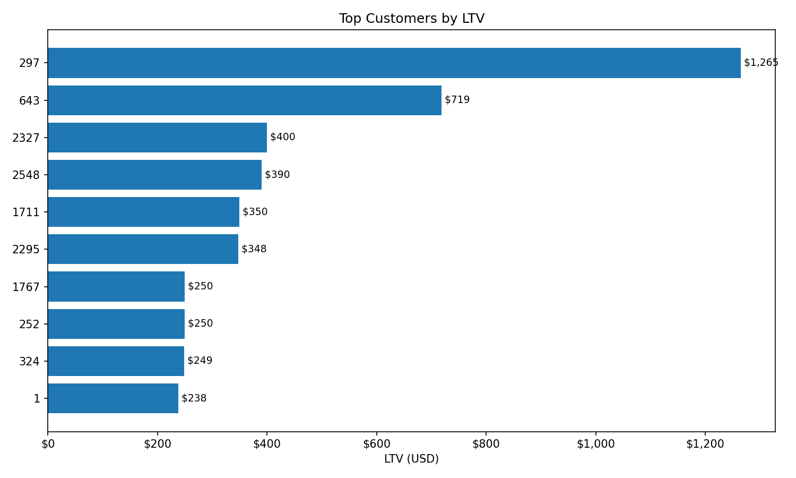
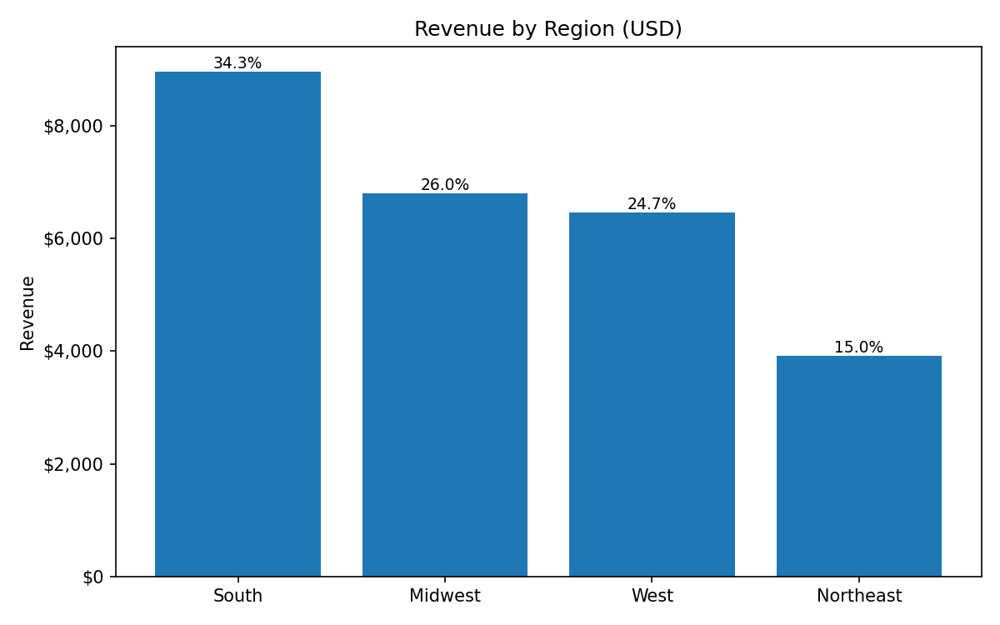

# README.md

# SQL E-commerce Analytics 2024

**One-liner:** Analyzed 2024 e-commerce transactions to identify top customers, regional sales trends, and product performance for strategic decisions.

## 🔍 Overview

End-to-end SQL data cleaning and business analytics on an e-commerce dataset. Standardizes raw CSVs into a star schema and produces KPIs (Revenue, Margin, AOV, LTV, Repeat Rate) and insights across customers, products, regions, seasons, and payment methods.

## 🧱 Dataset
- `data/customer_details.csv` — customer attributes.  
- `data/orders_2024.csv` — user/product interactions (purchase/view/like) with timestamps.  
- `data/product_details.csv` — product catalog with pricing and metadata.  

> See `data/DATASET.md` if you need to re-download or substitute a public dataset.

## 🗺️ Data Model
Star schema:
- Dimensions: `dim_customer`, `dim_product`, `dim_calendar`, (optional) `dim_region`  
- Fact: `fact_sales` (one row per purchased product line)

## 🧼 Cleaning Highlights
- Enforced primary keys & referential integrity  
- Standardized domains (payment method, region); dropped empty columns  
- Parsed prices from strings; normalized timestamps (Europe/London)  
- Generated surrogate `order_id` for purchases  

## 📊 KPIs
- **Net Revenue, COGS, Gross Profit, Gross Margin %**  
- **AOV, Purchase Frequency, Repeat Rate**  
- **LTV (2024 simple), Category Contribution**  
- **Seasonal & Regional Mix, Payment Mix, Return Rate**  

## 🧠 Key Insights (update after running queries)
- Top 10 customers contributed **X%** of revenue; highest LTV: `C123` (£**X**).  
- Best category by margin: `Category A` (**X%** GM).  
- Peak season: `Summer` (**+Y%** vs avg); Top region: `Region R`.  
- Highest AOV by payment method: `BNPL` (**+Z%** vs overall).  
- Repeat customers drove **X%** of orders; **30-day** repeat rate **Y%**.

## 🖼️ Visuals
-   
-   
-   
-   
-   
-   

## 🧪 How to Run
1. Load CSVs into your SQL engine (Postgres/MySQL/SQLite).  
2. Execute in order:  
   - `sql/01_schema_and_load.sql`  
   - `sql/02_cleaning_rules.sql`  
   - `sql/03_dimensions.sql`  
   - `sql/04_fact_sales.sql`  
   - `sql/05_kpi_views.sql`  
   - `sql/06_analysis_queries.sql`  
   - `sql/07_data_quality_checks.sql`  
3. Export KPI/query outputs and save PNGs into `images/`.

## 📐 Metric Definitions
See `docs/DATA_DICTIONARY.md` (“Derived Fields”) and KPI formulas listed in this README.

## ⚠️ Limitations
- Orders file mixes interactions; only `purchase` are sales.  
- COGS not provided; margin requires an assumption or external table.  
- Product prices may be missing/inconsistent; parsed from strings.

## ➕ Next Steps
- Add RFM/cohort analysis & segmentation  
- Append 2025 data and automate a rolling pipeline  
- Incorporate returns/refunds if available

## 🛠️ Tools
SQL (Postgres/MySQL/SQLite), CSV, BI/Spreadsheet for charts.

---
**Author:** _Your Name_ • **Role:** Data/Business Analyst • **Year:** 2024
